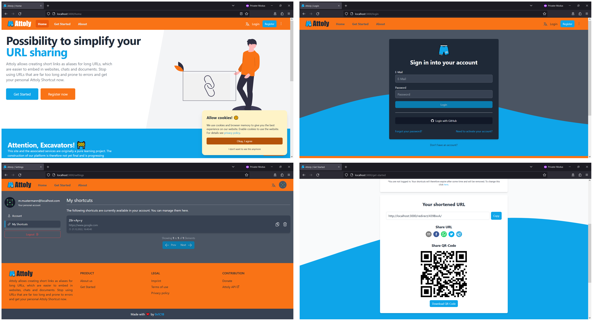

# Attoly Web

> Responsive 1st party web client for the Attoly URL shortener platform.

## Table of contents

- [Introduction](#introduction)
- [License](#license)
  - [Forbidden](#forbidden)

## Introduction

This is the 1st party web client of the [Attoly Platform](https://github.com/0x1C1B/attoly-api). Attoly allow
creating short links as aliases for long URLs, which are easier to embed in websites, chats and documents. This
React based single page application provides the user with a user-friendly interface to operate the platform.
Originally, the Attoly Platform is a learning project to gain experience in distributed systems, user management,
and cloud deployment. Therefore there are no claims to maintenance, freedom from errors or further development.
Further development only occurs as part of the learning process.

## License

Copyright (c) 2025 Constantin Müller

[GNU AFFERO GENERAL PUBLIC LICENSE](https://www.gnu.org/licenses/) or [LICENSE](LICENSE.md) for
more details.

### Forbidden

**Hold Liable**: Software is provided without warranty and the software
author/license owner cannot be held liable for damages.
